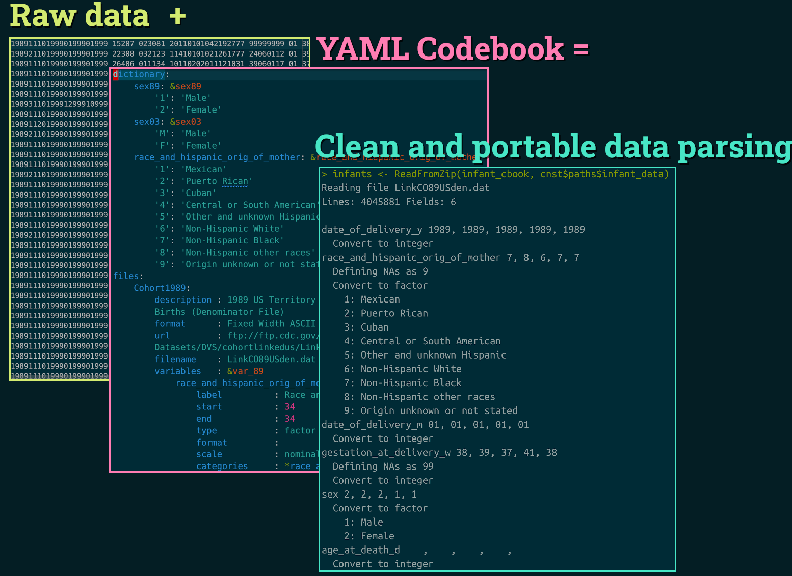

# YAML codebook example for parsing NCHS birth-infant death data in R

Jonas Schöley

For my thesis I harmonized raw US Birth/Infant death data across multiple years and disparate files. I found #YAML to be the perfect format for defining the codebook. Adoption in demography should be higher. Metadata is "Data", keep it separate from your source code.

This repository provides code to download individual level data on births, fetal and Infant deaths in the US from 1989 to 2015. Using a YAML codebook this data is the parsed into R.

